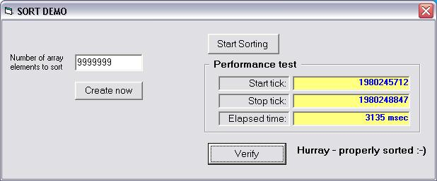



## Radix Sort \(JunusSort revised\)

### Description

Very fast integer sorter. Using 1800 MHz Athlon processor will sort ten million integers in just over three seconds.

(see http://www.Planet-Source-Code.com/vb/scripts/ShowCode.asp?txtCodeId=59491&lngWId=1)
 
### More Info
 

             |
---                |---
**Submitted On**   |2005-03-17 04:06:02
**By**             |[ULLI](https://github.com/Planet-Source-Code/PSCIndex/blob/master/ByAuthor/ulli.md)
**Level**          |Intermediate
**User Rating**    |5.0 (45 globes from 9 users)
**Compatibility**  |VB 6\.0
**Category**       |[Miscellaneous](https://github.com/Planet-Source-Code/PSCIndex/blob/master/ByCategory/miscellaneous__1-1.md)
**World**          |[Visual Basic](https://github.com/Planet-Source-Code/PSCIndex/blob/master/ByWorld/visual-basic.md)
**Archive File**   |[Radix\_Sort1865373172005\.zip](https://github.com/Planet-Source-Code/ulli-radix-sort-junussort-revised__1-59513/archive/master.zip)

